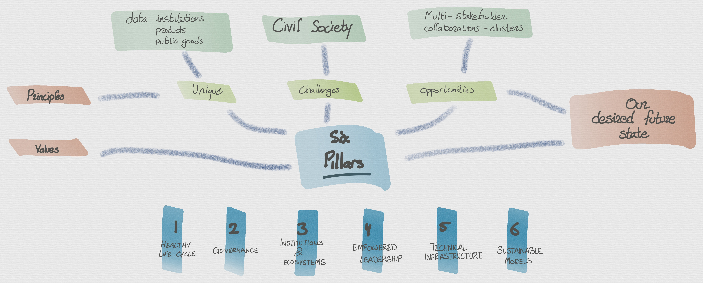

What does it take to build effective and resilient digital products in civil society?

Products in civil society often take the form of digital public goods. They are free resources that benefit or empower the general public. They are designed and managed responsibly. These resources are often created by academics, non profit organizations, community based organization, or through a collaboration of teams. To be sustainable, they must balance power among stakeholders and define a long-term plan for funding and resources. They must plan for the governance and ownership of the data they use during and beyond their own lifespans.

**How can such initiatives be successful?** 
**What support systems and environments can we provide so that these resources can flourish and benefit everyone?**

The central ideas in this garden revolve around [Six Pillars](pillars-of-capacity.md) that strengthen data initiatives in civil society. These pillars are motivated by a discussion of the [challenges faced](challenges.md) as well as the [opportunities](opportunities.md) in what will be a pivotal decade ahead. Guiding the work in this space are [principles](principles.md) to help ensure we do not drift from our values. And finally, we outline a vision for the [desired future state](desired_future_state.md) that can be achieved through this work and by reinforcement of the six pillars.

These concepts are visualized in this sketch. 

On each page I will provide the key ideas, examples to help illustrate the concepts, and references to further reading on the topic.

Lost? A great place to start is ["Why is civil society important?"](why-is-civil-society-important.md).

*This area is experimental and a work in progress. Feedback on form or content is very welcome, as are direct contributions, which can be made through the [github repo](https://github.com/amanahuja/civil-society-garden/).*
